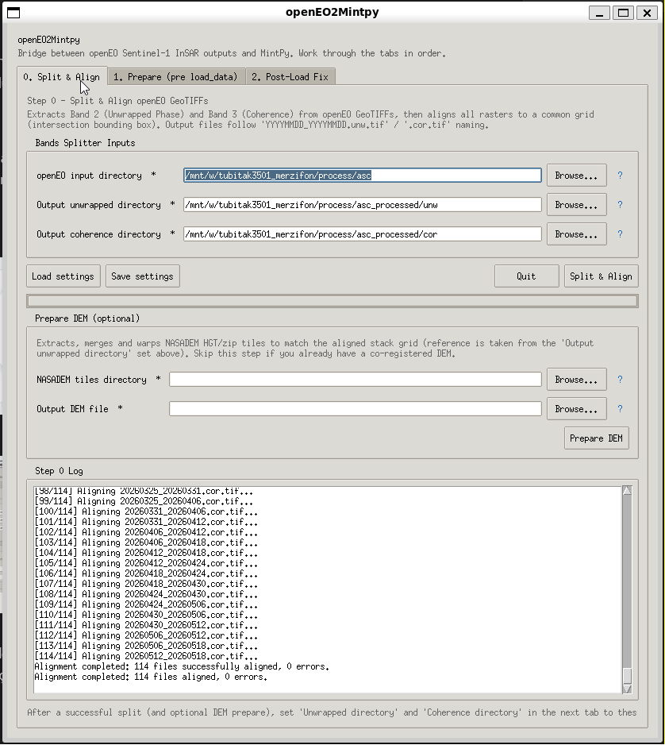
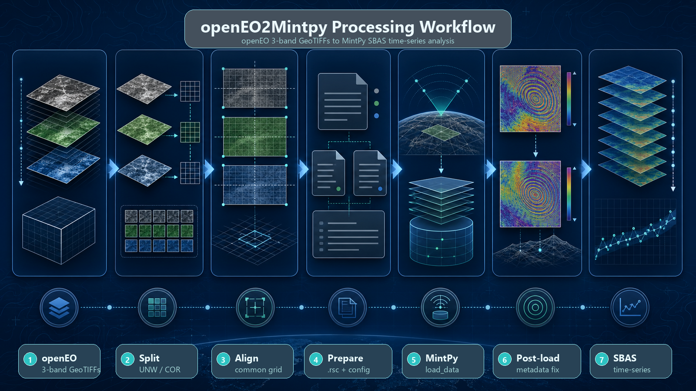

<p align="center">
  
</p>

<p align="center">
  <a href="https://github.com/bcankara/openEO2Mintpy/actions"></a>
  <a href="https://opensource.org/licenses/MIT"></a>
  <a href="https://www.python.org/downloads/"></a>
  <a href="#installation"></a>
</p>

<p align="center">
  <strong>Bridge CDSE openEO Sentinel-1 InSAR outputs into MintPy-ready stacks.</strong><br>
  Split openEO 3-band GeoTIFFs, align rasters, prepare ROI_PAC-style sidecars,
  build MintPy config files, and patch post-load metadata when needed.
</p>

---

## What It Does

`openEO2Mintpy` is a lightweight Python utility for moving Copernicus Data Space
Ecosystem (CDSE) **openEO Sentinel-1 InSAR** products into **MintPy** time-series
processing. It focuses on the practical format gap between openEO outputs and
MintPy's input expectations.

openEO InSAR products are commonly delivered as **3-band GeoTIFFs**:

| Band | Meaning | openEO2Mintpy output |
| :--- | :--- | :--- |
| Band 1 | Wrapped phase | Not used for MintPy time-series ingestion |
| Band 2 | Unwrapped phase | `YYYYMMDD_YYYYMMDD.unw.tif` |
| Band 3 | Coherence | `YYYYMMDD_YYYYMMDD.cor.tif` |

MintPy expects separate rasters, stable date-pair names, `.rsc` metadata
sidecars, and a consistent stack geometry. `openEO2Mintpy` automates these
bridge steps without changing the scientific raster values.

---

## Desktop GUI

Launch the graphical assistant when you want an interactive, tab-based workflow:

```bash
openeo2mintpy
# or
openeo2mintpy gui
```

The GUI walks through the same pipeline as the CLI: **Split & Align**, optional
**DEM preparation**, **Prepare** before MintPy `load_data`, and **Post-Load Fix**
after MintPy has created its HDF5 inputs.



---

## Workflow



1. Split openEO 3-band GeoTIFFs into unwrapped phase and coherence rasters.
2. Align all split rasters to a common bounding box and grid.
3. Optionally merge and warp NASADEM tiles to the same grid.
4. Generate `.rsc` sidecars and a MintPy configuration file.
5. Run MintPy `load_data`.
6. Patch HDF5 `PROCESSOR` attributes if the MintPy chain requires ISCE-style
   geometry lookup.
7. Continue with the normal MintPy SBAS/time-series workflow.

---

## Key Features

- **openEO band splitter**: extracts Band 2 as unwrapped phase and Band 3 as
  coherence from openEO Sentinel-1 InSAR GeoTIFFs.
- **MintPy naming bridge**: converts timestamp-heavy openEO filenames into
  MintPy-friendly `YYYYMMDD_YYYYMMDD` date-pair names.
- **Stack alignment**: intersects raster bounds and warps the stack to a common
  grid using GDAL.
- **NASADEM preparation**: extracts, merges, and aligns NASADEM zip/HGT tiles to
  the InSAR stack grid.
- **ROI_PAC `.rsc` sidecars**: writes MintPy-readable sidecar metadata for
  unwrapped phase, coherence, connected components, and geometry rasters.
- **ISCE2 metadata support**: reads reference XML and baseline directories for
  wavelength, heading, sensing time, incidence angle, and perpendicular baseline
  values.
- **MintPy config generation**: creates a practical `mintpy_config.txt` with
  input globs and geometry paths.
- **Post-load processor patch**: verifies and rewrites HDF5 processor attributes
  after MintPy `load_data` when a hybrid openEO/ISCE/MintPy workflow needs it.
  Supports both `geometryRadar.h5` and `geometryGeo.h5` auto-detection.
- **GUI and CLI parity**: supports repeatable command-line runs and an
  interactive Tkinter desktop interface.

---

## Installation

### Prerequisites

- Python `3.9` or newer
- GDAL `3.0` or newer
- Tkinter for the GUI

GDAL is easiest to install from `conda-forge`:

```bash
conda install -c conda-forge gdal
```

On Linux/WSL, install Tkinter if it is not already available:

```bash
sudo apt install python3-tk
```

### Install From Source

```bash
git clone https://github.com/bcankara/openEO2Mintpy.git
cd openEO2Mintpy
pip install -e .
```

For development:

```bash
pip install -e ".[dev]"
```

---

## Quick Start: CLI Pipeline

### 1. Split openEO outputs

```bash
openeo2mintpy split \
    --input-dir ./openeo_downloads \
    --unw-dir ./unwrapped \
    --cor-dir ./coherence
```

### 2. Align the stack

```bash
openeo2mintpy align \
    --unw-dir ./unwrapped \
    --cor-dir ./coherence
```

### 3. Prepare DEM, optional

```bash
openeo2mintpy prepare-dem \
    --unw-dir ./unwrapped \
    --zip-dir ./nasadem_downloads \
    --output-file ./mintpy/dem.tif
```

### 4. Generate `.rsc` sidecars

```bash
openeo2mintpy prepare \
    --unw-dir ./unwrapped \
    --cor-dir ./coherence \
    --baseline-dir ./baselines \
    --ref-xml ./reference/IW2.xml \
    --ref-date 20251124
```

Use `--geometry-mode radar` if your stack should be treated as radar geometry,
or `--geometry-mode geo` when the GeoTIFFs are fully geocoded.

### 5. Generate MintPy config

```bash
openeo2mintpy generate-config \
    --work-dir ./mintpy \
    --unw-dir ./unwrapped \
    --cor-dir ./coherence \
    --dem-file ./mintpy/dem.tif \
    --processor isce
```

For radar-geometry workflows, pass lookup rasters when available:

```bash
openeo2mintpy generate-config \
    --work-dir ./mintpy \
    --unw-dir ./unwrapped \
    --cor-dir ./coherence \
    --dem-file ./geometry/hgt.rdr.full \
    --inc-angle-file ./geometry/los.rdr.full \
    --az-angle-file ./geometry/los.rdr.full \
    --lookup-y-file ./geometry/lat.rdr.full \
    --lookup-x-file ./geometry/lon.rdr.full \
    --processor isce
```

### 6. Run MintPy load_data

```bash
cd mintpy
smallbaselineApp.py mintpy_config.txt --dostep load_data
```

### 7. Apply post-load fix

Run this after MintPy has created `mintpy/inputs/ifgramStack.h5` and the
geometry HDF5 file. The utility dynamically detects whether your stack is in
radar geometry (`geometryRadar.h5`) or geocoded geometry (`geometryGeo.h5`):

```bash
openeo2mintpy fix-processor --inputs-dir ./mintpy/inputs
```

Inspect first without modifying files:

```bash
openeo2mintpy fix-processor --inputs-dir ./mintpy/inputs --verify-only
```

You can also pass custom targets explicitly (e.g. for geocoded files):

```bash
openeo2mintpy fix-processor --inputs-dir ./mintpy/inputs --targets ifgramStack.h5 geometryGeo.h5
```

Then continue the MintPy workflow:

```bash
smallbaselineApp.py mintpy_config.txt
```

---

## Common Commands

```bash
# Show stack counts and date range
openeo2mintpy info --unw-dir ./unwrapped --cor-dir ./coherence

# Use nearest-neighbor alignment instead of bilinear
openeo2mintpy align --unw-dir ./unwrapped --cor-dir ./coherence --resample near

# Write only MintPy config with a custom filename
openeo2mintpy generate-config \
    --work-dir ./mintpy \
    --unw-dir ./unwrapped \
    --config-name smallbaselineApp.cfg

# Patch custom HDF5 targets
openeo2mintpy fix-processor \
    --inputs-dir ./mintpy/inputs \
    --targets ifgramStack.h5 geometryRadar.h5
```

---

## Expected Directory Layout

```text
project/
├── openeo_downloads/
│   ├── phase_coh_20251124T035010_20251130T034907.tif
│   └── phase_coh_20251130T034907_20251206T035022.tif
├── unwrapped/
│   ├── 20251124_20251130.unw.tif
│   └── 20251130_20251206.unw.tif
├── coherence/
│   ├── 20251124_20251130.cor.tif
│   └── 20251130_20251206.cor.tif
├── baselines/
│   └── 20251124_20251130/
├── reference/
│   └── IW2.xml
└── mintpy/
    ├── dem.tif
    ├── mintpy_config.txt
    └── inputs/
        ├── ifgramStack.h5
        └── geometryRadar.h5
```

---

## Package Structure

```text
openEO2Mintpy/
├── src/openeo2mintpy/
│   ├── align.py           # Raster alignment and DEM preparation
│   ├── cli.py             # CLI entry point
│   ├── config.py          # MintPy config generator
│   ├── constants.py       # Sentinel-1 and RSC defaults
│   ├── gui.py             # Tkinter desktop GUI
│   ├── metadata.py        # ISCE2 XML, baseline, and GDAL metadata parsing
│   ├── postprocess.py     # HDF5 processor-attribute verification/patching
│   ├── prepare.py         # RSC sidecar generation
│   ├── settings.py        # GUI settings persistence
│   └── split.py           # GDAL-based openEO band splitter
├── docs/
│   ├── architecture.md
│   └── assets/
├── examples/
├── tests/
├── pyproject.toml
└── README.md
```

---

## Development

```bash
pip install -e ".[dev]"
pytest
ruff check .
```

The test suite covers CLI dispatch, metadata parsing, stack preparation,
post-load verification, and GUI importability.

---

## License

This project is licensed under the MIT License. See [LICENSE](LICENSE).

---

## Contact

**Burak Can KARA**  
Department of Construction, Merzifon Vocational School, Amasya University  
Email: [burakcan.kara@amasya.edu.tr](mailto:burakcan.kara@amasya.edu.tr)  
Website: [bcankara.com](https://bcankara.com)  
GitHub: [@bcankara](https://github.com/bcankara)
