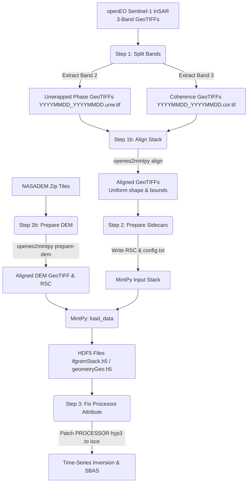

# openEO2Mintpy

[](https://github.com/bcankara/openEO2Mintpy/actions)
[](https://opensource.org/licenses/MIT)
[](https://www.python.org/downloads/)
[](#installation)

`openEO2Mintpy` is a lightweight Python utility designed to bridge Copernicus Data Space Ecosystem (CDSE) **openEO** Sentinel-1 InSAR outputs into **MintPy** for time-series analysis. It features both a scriptable Command Line Interface (CLI) and a desktop Graphical User Interface (GUI).

---

## Overview

When processing Sentinel-1 InSAR data with Copernicus openEO, the resulting interferometric pairs are packaged as **3-band GeoTIFFs**:
- **Band 1**: Wrapped Phase (not used by MintPy time-series analysis)
- **Band 2**: Unwrapped Phase (extracted as `.unw.tif`)
- **Band 3**: Coherence (extracted as `.cor.tif`)

**MintPy** expects separate, single-band rasters with strict naming conventions, accompanied by ROI_PAC-style `.rsc` metadata sidecars. `openEO2Mintpy` automates the entire conversion process, metadata extraction, and post-load fixes in a seamless pipeline.

---

## Pipeline Workflow

The processing flow is structured as follows:



---

## Features

- **Band Splitting**: Extract Unwrapped Phase (Band 2) and Coherence (Band 3) from openEO output rasters.
- **Smart Renaming**: Automatically maps openEO timestamp-based filenames to standard `YYYYMMDD_YYYYMMDD` formats.
- **Raster Alignment**: Computes the spatial intersection of all stack rasters and warps/aligns them using GDAL to resolve differing dimensions.
- **DEM Merging and Alignment**: Extracts, merges, and warps NASADEM tiles to match the exact extent, resolution, and CRS of the InSAR stack, and generates its sidecar `.rsc` file.
- **ROI_PAC `.rsc` Sidecars**: Generates metadata sidecars required by MintPy's GDAL reader (including geometry, bounds, heading, wavelength, and orbits).
- **Metadata Extraction**: Parses ISCE2 Reference XML files to auto-populate sensor and baseline parameters.
- **HDF5 Processor Patch**: Fixes the `PROCESSOR` attribute from `hyp3` to `isce` in MintPy's generated HDF5 files to allow correct geometry lookup.
- **Cross-Platform GUI & CLI**: Complete command line utilities for automated execution and a Tkinter-based desktop interface for interactive runs.

---

## Installation

### Prerequisites
- **Python**: Version 3.9 or higher.
- **GDAL**: Required for band splitting. We recommend installing it via conda.

### Steps
1. **Clone the repository**:
   ```bash
   git clone https://github.com/bcankara/openEO2Mintpy.git
   cd openEO2Mintpy
   ```

2. **Install GDAL** (if not already installed):
   ```bash
   conda install -c conda-forge gdal
   ```

3. **Install the package in editable mode**:
   ```bash
   pip install -e .
   ```

---

## Quick Start

### Graphical User Interface (GUI)
Launch the 3-tab graphical assistant to guide you through the process:
```bash
openeo2mintpy
# or explicitly
openeo2mintpy gui
```

### Command Line Interface (CLI)

```bash
# Step 1: Split openEO 3-band GeoTIFFs into single-band rasters
openeo2mintpy split \
    --input-dir ./openeo_downloads \
    --unw-dir   ./unwrapped \
    --cor-dir   ./coherence

# Step 1b: Align all split unwrapped phase and coherence rasters to a common grid
# Resolves different dimensions due to orbital variations.
openeo2mintpy align \
    --unw-dir   ./unwrapped \
    --cor-dir   ./coherence

# Step 1c (Optional): Unzip, merge, and align NASADEM tiles to match InSAR grid
openeo2mintpy prepare-dem \
    --unw-dir     ./unwrapped \
    --zip-dir     ./nasadem_downloads \
    --output-file ./mintpy/dem.tif

# Step 2: Generate .rsc metadata sidecars for the InSAR stack
openeo2mintpy prepare \
    --unw-dir      ./unwrapped \
    --cor-dir      ./coherence \
    --baseline-dir ./baselines \
    --ref-xml      ./reference/IW2.xml \
    --ref-date     20251124

# Step 2b: Generate MintPy configuration file (mintpy_config.txt)
openeo2mintpy generate-config \
    --work-dir     ./mintpy \
    --unw-dir      ./unwrapped \
    --cor-dir      ./coherence \
    --dem-file     ./mintpy/dem.tif \
    --processor    hyp3

# (Run MintPy data loading)
# smallbaselineApp.py ./mintpy/mintpy_config.txt --dostep load_data

# Step 3: Patch HDF5 processor attributes for MintPy processing
openeo2mintpy fix-processor \
    --inputs-dir ./mintpy/inputs
```

---

## Requirements

| Dependency | Min Version | Purpose |
| :--- | :--- | :--- |
| **Python** | `3.9` | Runtime environment |
| **numpy** | `1.20` | Numerical array handling |
| **h5py** | `3.0` | HDF5 metadata patching |
| **GDAL** | `3.0` | Geospatial raster operations |
| **Tkinter** | - | GUI interface (standard in Python) |

*Note: On Linux/WSL, you may need to install Tkinter manually:*
```bash
sudo apt install python3-tk
```

---

## Directory Structure

```text
openEO2Mintpy/
├── src/openeo2mintpy/
│   ├── align.py           # Raster alignment & DEM preparation
│   ├── cli.py             # CLI entry point
│   ├── config.py          # MintPy config file generator
│   ├── constants.py       # Global constants
│   ├── gui.py             # Tkinter desktop GUI
│   ├── metadata.py        # ISCE2 XML & baseline parser
│   ├── postprocess.py     # HDF5 metadata patching
│   ├── prepare.py         # RSC metadata generator
│   ├── settings.py        # Local settings persistence
│   └── split.py           # GDAL-based band splitter
├── tests/                 # Unit test suite
├── docs/                  # Additional documentation
├── examples/              # Sample configurations
├── pyproject.toml         # Package definition and build system
├── LICENSE                # MIT License
└── README.md              # Project documentation
```

---

## Development

To set up a development environment and run tests:

```bash
# Install development dependencies
pip install -e ".[dev]"

# Run tests
pytest

# Check code style
ruff check .
```

---

## License

This project is licensed under the MIT License. See the [LICENSE](LICENSE) file for details.

---

## Contact

**Dr. Burak Can KARA** - Amasya University  
- Email: [burakcankara@gmail.com](mailto:burakcankara@gmail.com)  
- Website: [bcankara.com](https://bcankara.com)  
- GitHub: [@bcankara](https://github.com/bcankara)
