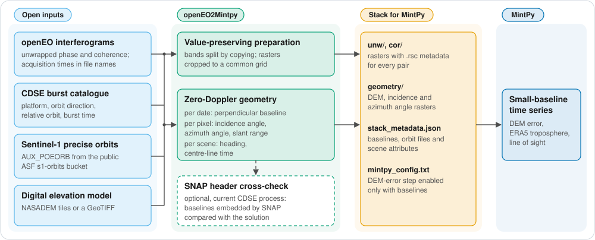

<h1 align="center">
  
</h1>

<p align="center">
  Orbit-derived acquisition geometry for Sentinel-1 interferograms from the
  Copernicus Data Space Ecosystem openEO service, prepared for MintPy
  small-baseline time-series analysis
</p>

<p align="center">
  <a href="https://github.com/bcankara/openEO2Mintpy/actions/workflows/ci.yml"></a>
  <a href="https://www.python.org/"></a>
  <a href="LICENSE"></a>
</p>

<p align="center">
  
</p>

## Overview

The Copernicus Data Space Ecosystem (CDSE) openEO service delivers geocoded
Sentinel-1 interferograms processed in the cloud, so that small-baseline time
series can be computed without downloading and processing single-look complex
(SLC) data. MintPy, however, also needs the acquisition geometry of every
interferogram: the perpendicular baseline for the topographic-residual
(DEM-error) correction, the incidence and azimuth angles for the line-of-sight
projection, and the acquisition time for the tropospheric correction. The
openEO products do not provide a valid geometry. Products of the earlier
ClouDInSAR workflow branch carry no orbit, baseline or viewing-geometry
information. Products of the current process embed a SNAP header whose
incidence-angle fields hold 99999, the value SNAP keeps for an attribute that
has not been set. MintPy accepts such placeholder values, as well as nominal
values filled in by a preparation step, without a plausibility check.

openEO2Mintpy reconstructs the per-date perpendicular baselines and the
per-pixel viewing geometry from open inputs alone: the acquisition times in the
product names, the public CDSE burst catalogue, the Sentinel-1 precise orbits
and a digital elevation model (DEM). No SLC data are required. The package also
requests and downloads the interferograms through openEO, prepares the rasters
without changing their values, and writes a stack that MintPy loads directly.

## Method

| Quantity required by MintPy | Source in openEO2Mintpy |
| :-- | :-- |
| Acquisition dates and times | Product file names (`..._YYYYMMDDTHHMMSS_YYYYMMDDTHHMMSS.tif`) |
| Platform, orbit direction, relative orbit, burst azimuth time | CDSE burst catalogue (OData, no account needed) |
| Satellite position and velocity | Sentinel-1 precise orbits (AUX_POEORB, AUX_RESORB as fallback) from the public ASF `s1-orbits` bucket |
| Perpendicular baseline per date | Zero-Doppler solution on the precise orbits |
| Incidence angle, azimuth angle and slant range per pixel | Same solution on the stack grid, with the DEM |
| Heading, centre-line time, satellite height | Same solution at the scene centre |
| DEM on the stack grid | NASADEM tiles or any DEM GeoTIFF, resampled onto the stack grid |

**Geometry.** Satellite positions and velocities are interpolated from the
orbit state vectors with an eight-point Lagrange polynomial, and the
zero-Doppler time of each ground target is found by Newton iteration. The
perpendicular baseline of each date is computed relative to the first date, or
to a chosen reference date, over a grid of ground targets and follows the sign
convention of the ISCE2 `topsStack` processor. The results are written to
`geometry/stack_metadata.json`, to incidence- and azimuth-angle rasters and to
the `.rsc` metadata of every pair.

**Raster preparation.** The unwrapped phase and the coherence are copied out
of the three-band openEO products without modification. When all rasters share
the pixel size and integer pixel offsets, which holds for the burst products of
one stack, they are cropped to their common intersection by array slicing, so
that no value is resampled; otherwise they are warped with a selectable kernel.
`alignment_report.json` records the method, the target grid and the offset of
every file.

**Products of the current CDSE process.** These products embed SNAP's DIMAP
header in TIFF tag 65000. When the header is present, the pair baselines that
SNAP stores are compared with the reconstructed ones (sign reversed), and
differences above 1 m are reported as a warning. MintPy's SNAP reader is not
used, because it would take the unset incidence angle (99999) as the incidence
angle of the scene.

## Validation

In the accompanying study, two Sentinel-1 burst stacks over Merzifon (Türkiye)
were prepared with the code of this release. The reconstructed perpendicular baselines
agreed with the orbit routines of ISCE2 within 9 mm and with the baseline
service of the Alaska Satellite Facility within 3.3 m and 1.5 m root-mean-square,
and the incidence angles agreed with the Sentinel-1 annotation within 0.06°.
The test suite (117 tests) checks the orbit interpolation and the zero-Doppler
solver against an analytic orbit, the angle and baseline conventions, the
catalogue matching, the lattice crop, the sidecar generation, the openEO client
(mocked), the command-line dispatch and the post-load verification.

## Installation

openEO2Mintpy requires Python 3.9 or newer and the GDAL Python bindings. MintPy
is needed for the time-series analysis but is not imported by the package;
Tkinter is needed for the graphical interface. GDAL and MintPy are most easily
installed from conda-forge:

```bash
conda create -n openeo2mintpy -c conda-forge python=3.11 gdal mintpy
conda activate openeo2mintpy
git clone https://github.com/bcankara/openEO2Mintpy.git
cd openEO2Mintpy
pip install -e .
```

`pip install -e ".[mintpy]"` installs MintPy from PyPI when it is not installed
through conda, and `pip install -e ".[dev]"` adds the test and lint tools. On
Linux and WSL, Tkinter may have to be installed separately
(`sudo apt install python3-tk`).

## Usage

### Command-line workflow

The example follows the ascending stack of the accompanying study.

1. List the Sentinel-1 bursts that cover an area and period (no account needed):

   ```bash
   openeo2mintpy search --start 2025-11-20 --end 2026-05-20 --bbox 35.3 40.8 35.6 41.0
   ```

2. Generate small-baseline pairs for one burst and submit the openEO jobs
   (CDSE account needed). `--dry-run` prints the dates, pairs and job groups
   without submitting.

   ```bash
   openeo2mintpy submit --start 2025-11-20 --end 2026-05-20 \
       --bbox 35.3 40.8 35.6 41.0 --track 14 --burst-id 28163 --sub-swath IW2 \
       --max-temporal-baseline 24 --manifest jobs_asc.json
   ```

   Each job calls the published CDSE process `sentinel1_sar_interferogram`
   (ESA APEx catalogue). The earlier ClouDInSAR workflow branch remains
   available through `--cwl-url`.

3. Download the products:

   ```bash
   openeo2mintpy download --manifest jobs_asc.json --output-dir ./raw_asc --wait
   ```

4. Prepare the stack for MintPy. `process` runs `split`, `align`,
   `prepare-dem`, `metadata`, `prepare` and `generate-config`; `--dem-source`
   takes a directory of NASADEM tiles or a single DEM file.

   ```bash
   openeo2mintpy process --input-dir ./raw_asc --work-dir ./asc --dem-source ./nasadem
   ```

5. Run MintPy:

   ```bash
   cd asc/mintpy
   smallbaselineApp.py mintpy_config.txt --dostep load_data
   openeo2mintpy fix-processor --inputs-dir ./inputs --targets ifgramStack.h5 geometryGeo.h5
   smallbaselineApp.py mintpy_config.txt --start modify_network
   ```

The configuration enables the topographic-residual step only when baselines
are available. Because the centre-line time is written, the ERA5 tropospheric
correction can be enabled with `generate-config --tropo-method pyaps` once a
CDS API key is configured.

### Individual steps

```bash
openeo2mintpy split --input-dir ./raw_asc --unw-dir ./asc/unw --cor-dir ./asc/cor
openeo2mintpy align --unw-dir ./asc/unw --cor-dir ./asc/cor          # --method auto|crop|warp
openeo2mintpy prepare-dem --unw-dir ./asc/unw --zip-dir ./nasadem --output-file ./asc/geometry/dem.tif
openeo2mintpy metadata --input-dir ./raw_asc --unw-dir ./asc/unw \
    --dem-file ./asc/geometry/dem.tif --output-dir ./asc/geometry
openeo2mintpy prepare --unw-dir ./asc/unw --cor-dir ./asc/cor \
    --metadata ./asc/geometry/stack_metadata.json
openeo2mintpy generate-config --work-dir ./asc/mintpy --unw-dir ./asc/unw \
    --cor-dir ./asc/cor --metadata ./asc/geometry/stack_metadata.json
openeo2mintpy info --unw-dir ./asc/unw --metadata ./asc/geometry/stack_metadata.json
```

### Graphical interface

`openeo2mintpy` without arguments, or `openeo2mintpy gui`, opens a Tkinter
interface with four tabs that follow the same sequence: *0. openEO Dispatcher*
(login, burst search on a map, pair generation, job submission and download),
*1. Split, Align & Metadata*, *2. Prepare (pre load_data)* and
*3. Post-Load Fix*.

### Access to the CDSE openEO service

Requesting interferograms requires a free CDSE account
(<https://dataspace.copernicus.eu>). openEO jobs consume processing credits from
the monthly allowance of the account. Login uses OpenID Connect; in WSL and
headless sessions the device-code flow is used. The burst catalogue and the
precise orbits are public, so the metadata step needs no account.

## Output

```text
project/
├── raw_asc/                      openEO products and job-results.json
└── asc/
    ├── alignment_report.json
    ├── unw/  YYYYMMDD_YYYYMMDD.unw.tif and .rsc for every pair
    ├── cor/  YYYYMMDD_YYYYMMDD.cor.tif and .rsc for every pair
    ├── geometry/
    │   ├── dem.tif, incidenceAngle.tif, azimuthAngle.tif and .rsc
    │   ├── stack_metadata.json   catalogue match, orbit files, baselines, scene attributes
    │   └── orbits/               precise orbit files
    └── mintpy/
        ├── mintpy_config.txt
        └── inputs/               ifgramStack.h5, geometryGeo.h5 (written by MintPy)
```

The module structure and the data flow are described in
[docs/architecture.md](docs/architecture.md); a worked example is given in
[examples/workflow_example.md](examples/workflow_example.md).

## Development

```bash
pip install -e ".[dev]"
pytest
ruff check src tests
```

Continuous integration runs the lint check and the test suite on Python 3.9 to
3.12 with GDAL from conda-forge.

## Citation

A journal article describing the method and its validation is in preparation.
Until it is published, please cite the software; the metadata are given in
[CITATION.cff](CITATION.cff).

```bibtex
@software{kara_openeo2mintpy,
  author  = {Kara, Burak Can},
  title   = {{openEO2Mintpy}},
  version = {1.0.0},
  year    = {2026},
  url     = {https://github.com/bcankara/openEO2Mintpy}
}
```

## Acknowledgements

The interferograms are produced by the CDSE openEO service with the ClouDInSAR
workflow ([cloudinsar/s1-workflows](https://github.com/cloudinsar/s1-workflows)).
The Sentinel-1 precise orbit products are provided by ESA through the
Copernicus programme and distributed by the Alaska Satellite Facility on the
[Registry of Open Data on AWS](https://registry.opendata.aws/s1-orbits/).
The time-series analysis uses MintPy (Yunjun et al., 2019,
<https://doi.org/10.1016/j.cageo.2019.104331>).

## License

openEO2Mintpy is distributed under the MIT License; see [LICENSE](LICENSE).

## Contact

Burak Can Kara, Department of Construction, Merzifon Vocational School, Amasya
University, Amasya, Türkiye<br>
[burakcan.kara@amasya.edu.tr](mailto:burakcan.kara@amasya.edu.tr) ·
ORCID [0000-0002-6933-0759](https://orcid.org/0000-0002-6933-0759) ·
[bcankara.com](https://bcankara.com)
